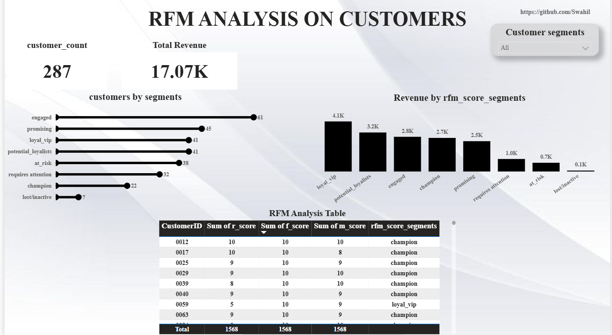

# RFM-Analysis-using-SQL-Big-Query-Power-BI
Performed RFM (Recency, Frequency, Monetary) analysis on customer purchasing behavior to identify customer segments, improve targeted marketing, and support customer retention decisions.
 ## Project Overview / Introduction
This project focuses on customer segmentation using the RFM (Recency, Frequency, Monetary) technique to support targeted marketing and customer retention strategies. Many businesses struggle to identify high-value customers, improve customer retention, and optimize marketing efforts. By analyzing customer purchasing behavior using RFM analysis, this project will help the business in making a more data-driven decision.

## Business Problem / Objective
Many businesses struggle to understand customer purchasing behavior, identify valuable customers and retain customers effectively. Without proper customer segmentation, marketing efforts can become too broad, inaccurate and costly.This challenge is solved through various techniques with RFM analysis being one of the best solutions to segment customers according to their transactional purchase practices.

________________________________________
## Dataset Overview
The dataset contains 12 monthly CSV files of customer purchases which contains data that will enable us get how recently a customer made a purchase, how frequent they purchase & the revenue they bring into the business.
###  Table Structure
Key Columns
- customer id
- order_date (Recency)
- order_id (Frequency)
- order_value(Monetary value)
- product_type
  
  ###  Dataset Purpose
The dataset was designed to help businesses 
- Understand customer spending behavior
- Identify loyal and high-value customers
- Detect inactive or at-risk customers
- Support personalized marketing campaigns
- Improve customer retention strategies
By examining customer transactions and spending patterns, the project aimed to segment customers into meaningful groups for targeted marketing, customer retention, and revenue optimization.

  ###  Notes
  - The presence of customer_id allows transactions to be aggregated per customer, which is essential for customer segmentation.
  - Since the dataset contains order_date and order_id, it can track purchasing timelines and buying behavior over time.
  - order_value enables analysis of customer revenue contribution and identification of high-value customers.
 
  **Dataset Link:**
  [data_source](/data_source)

  ## Schema

```sql
	--step1.Append all monthly tables together
  CREATE OR REPLACE TABLE `rfmanalysis1778.sales.sales_2025` AS 
	SELECT * FROM `rfmanalysis1778.sales.sales202501`
	UNION ALL SELECT * FROM `rfmanalysis1778.sales.sales202502`
	UNION ALL SELECT * FROM `rfmanalysis1778.sales.sales202503`
	UNION ALL SELECT * FROM `rfmanalysis1778.sales.sales202504`
	UNION ALL SELECT * FROM `rfmanalysis1778.sales.sales202505`
	UNION ALL SELECT * FROM `rfmanalysis1778.sales.sales202506`
	UNION ALL SELECT * FROM `rfmanalysis1778.sales.sales202507`
	UNION ALL SELECT * FROM `rfmanalysis1778.sales.sales202508`
	UNION ALL SELECT * FROM `rfmanalysis1778.sales.sales202509`
	UNION ALL SELECT * FROM `rfmanalysis1778.sales.sales202510`
	UNION ALL SELECT * FROM `rfmanalysis1778.sales.sales202511`
  UNION ALL SELECT * FROM `rfmanalysis1778.sales.sales202512`;
```


- ## Tools & Technologies

- PostgreSQL
- BigQuery
- Power BI
- Excel
- Git & GitHub

  ## Methodology

1.	Upload sales data to Big Query
2.	Calculate RFM values
3.	Assign decile scores
4.	Compute Aggregate RFM scores
5.	Define RFM segments
   -  0-3 **lost/inactive**
   -  4-7 **at risk**
   -  8-11 **requires attention**
   -  12-15 **engaged**
   -  16-19 **promising**
   -  20-23 **potential_loyalists**
   -  24-27 **loyal_vip**
   -  28-30 **champions**
     
7.	Build Power Bi report

## Key Questions Answered

- Who are the most valuable customers?
- Which customers are at risk of churning?
- Which customer segments generate the most revenue?
- Which customers require re-engagement campaigns?
- How can customer groups be segmented based on purchasing behavior?

## SQL Techniques Used

- data consolidation using UNION ALL
- Table Creation from Query Results (CREATE OR REPLACE TABLE)
- Views Creation (CREATE VIEW)
- aggregation functions (SUM, COUNT, MAX)
- date calculations (DATE_DIFF)
- window functions for ranking & bucketing (ROW_NUMBER, NTILE)
- Cmmon Table Expressions CTEs
- conditional logic (CASE statements)
- views to build an end-to-end RFM customer segmentation model.

  ## SQL Techniques Used
 ```sql
CREATE VIEW rfmanalysis1778.sales.metric
AS
WITH
  rfm AS (
    SELECT
      DATE_DIFF(CURRENT_DATE(), MAX(OrderDate), Day) AS recency,
      COUNT(OrderID) AS frequency,
      ROUND(SUM(OrderValue), 2) AS monetary,
      CustomerID
    FROM `rfmanalysis1778.sales.sales_2025`
    GROUP BY CustomerID
  )
SELECT
  rfm.*,
  ROW_NUMBER() OVER (ORDER BY rfm.recency ASC) AS r_rnk,
  ROW_NUMBER() OVER (ORDER BY rfm.frequency DESC) AS f_rnk,
  ROW_NUMBER() OVER (ORDER BY rfm.monetary DESC) AS m_rnk
FROM rfm;
```
**Objective;** Calculate recency.frequency & monetary metrics with ranks

```sql
CREATE VIEW rfmanalysis1778.sales.metric_score
AS
SELECT
  `rfmanalysis1778.sales.metric`.*,
  NTILE(10) OVER (ORDER BY r_rnk DESC) AS r_score,
  NTILE(10) OVER (ORDER BY f_rnk DESC) AS f_score,
  NTILE(10) OVER (ORDER BY m_rnk DESC) AS m_score
FROM `rfmanalysis1778.sales.metric`;

SELECT *
FROM `rfmanalysis1778.sales.metric_score`
ORDER BY m_rnk DESC;
```
**Objective;** Adding deciles so that we can generate the scores [1 LOWEST ,10 the BEST]

```sql
CREATE OR REPLACE VIEW `rfmanalysis1778.sales.total_rfm_score` AS
SELECT 
  CustomerID,
  recency,
  frequency,
  monetary,
  r_score,
  f_score,
  m_score,
  (r_score + f_score + m_score) AS total_rfm_score
FROM rfmanalysis1778.sales.metric_score
ORDER BY total_rfm_score DESC ;
```
**Objective;** CALCULATE THE TOTAL SCORES FOR EACH CUSTOMER

```sql
CREATE TABLE IF NOT EXISTS rfmanalysis1778.sales.rfm_score_segments AS
SELECT 
  CustomerID,
  recency,
  frequency,
  monetary,
  r_score,
  f_score,
  m_score,
  total_rfm_score,
  CASE 
      WHEN total_rfm_score >= 28 THEN 'champion'
      WHEN total_rfm_score >= 24 THEN 'loyal_vip'
      WHEN total_rfm_score >= 20 THEN 'potential_loyalists'
      WHEN total_rfm_score >= 16 THEN 'promising'
      WHEN total_rfm_score >= 12 THEN 'engaged '
      WHEN total_rfm_score >= 8 THEN 'requires attention'
      WHEN total_rfm_score >= 4 THEN 'at_risk '
      ELSE  'lost/inactive'
  END AS rfm_score_segments
FROM `rfmanalysis1778.sales.total_rfm_score`
ORDER BY total_rfm_score DESC;

SELECT
  rfm_score_segments,
  COUNT(CustomerID)
FROM `rfmanalysis1778.sales.rfm_score_segments`
GROUP BY rfm_score_segments;
```
**Objective;** CREATE SEGMENTS TO GROUP THE CUSTOMERS WITH REFERENCE TO THEIR rfm_score 


## Dashboard Preview



## Key Insights
- Engaged customers (RFM 12–15) are the largest segment (61 customers), showing strong ongoing activity.
- Loyal VIPs generate the highest revenue (KSh 4,070) with 41 customers, making them the most valuable group.
- At-risk customers (RFM 4–7) include 38 customers who may churn without intervention.
- Needs attention (RFM 8–11) includes 32 customers requiring re-engagement to prevent drop-off.

  ## Recommendations
  The RFM analysis highlights clear ways to improve customer value and retention by focusing on marketing, sales, and customer relationship management.
**Marketing**
Marketing should use targeted campaigns to retain Loyal VIP customers (41), move Promising (45) and Potential Loyalists (41) into higher-value segments, and re-engage customers who are at risk (38), need attention (32), or have gone inactive (7).

**Sales**
Sales can boost revenue by upselling and cross-selling to Engaged customers (61) and Potential Loyalists, while using bundles and timely offers to increase spending and recover customers who may be slipping away. On the strategy side, a strong CRM system is key to guiding customers through their journey from Promising to Loyal VIP, while also tracking churn risk and segment movement. Overall, growth depends on nurturing mid-tier customers, retaining high-value ones, and reducing churn in declining segments.

**Management / Strategy**
Management should focus on a retention-first approach that puts more emphasis on growing customer lifetime value rather than constantly acquiring new customers. The main priorities are expanding the Loyal VIP segment beyond 41 customers, reducing churn in the At Risk and Requires Attention groups, and upgrading Engaged customers (61) into higher-value segments. RFM segmentation should be treated as an ongoing tool for guiding business decisions rather than a one-off analysis. Overall, long-term growth will come from strengthening the Engaged and Potential Loyalist segments (102 customers combined), as they represent the strongest base for future revenue expansion.

## Author

Benjamin Njoroge Githua
- GitHub - 
- Email - benjaminnjoroge7@gmail.com


