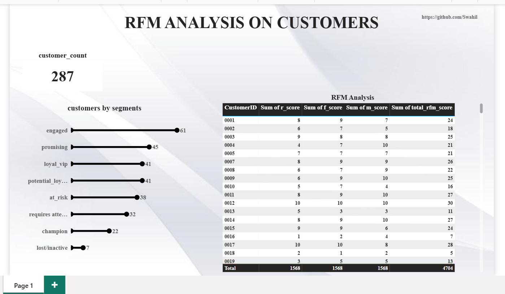

# RFM-Analysis-using-SQL-Big-Query-Power-BI
Performed RFM (Recency, Frequency, Monetary) analysis on customer purchasing behavior to identify customer segments, improve targeted marketing, and support customer retention decisions.
 ## Project Overview / Introduction
This project focuses on customer segmentation using the RFM (Recency, Frequency, Monetary) technique to support targeted marketing and customer retention strategies. Many businesses struggle to identify high-value customers, improve customer retention, and optimize marketing efforts. By analyzing customer purchasing behavior using RFM analysis, this project will help the business in making a more data-driven decision.

## Business Problem / Objective
Many businesses struggle to understand customer purchasing behavior, identify valuable customers and retain customers effectively. Without proper customer segmentation, marketing efforts can become too broad, inaccurate and costly.This challenge is solved through various techniques with RFM analysis being one of the best solutions to segment customers according to their transactional purchase practices.

________________________________________
## Dataset Overview
The dataset contains 12 monthly CSV files of customer purchases which contains data that will enable us get how recently a customer made a purchase, how frequent they purchase & the revenue they bring into the business.
###  Table Structure
Key Columns
- customer id
- order_date (Recency)
- order_id (Frequency)
- order_value(Monetary value)
- product_type
  
  ###  Dataset Purpose
The dataset was designed to help businesses 
- Understand customer spending behavior
- Identify loyal and high-value customers
- Detect inactive or at-risk customers
- Support personalized marketing campaigns
- Improve customer retention strategies
By examining customer transactions and spending patterns, the project aimed to segment customers into meaningful groups for targeted marketing, customer retention, and revenue optimization.

  ###  Notes
  - The presence of customer_id allows transactions to be aggregated per customer, which is essential for customer segmentation.
  - Since the dataset contains order_date and order_id, it can track purchasing timelines and buying behavior over time.
  - order_value enables analysis of customer revenue contribution and identification of high-value customers.
 
  **Dataset Link:**
  [data_source](/data_source)

  ## Schema

```sql
	--step1.Append all monthly tables together
  CREATE OR REPLACE TABLE `rfmanalysis1778.sales.sales_2025` AS 
	SELECT * FROM `rfmanalysis1778.sales.sales202501`
	UNION ALL SELECT * FROM `rfmanalysis1778.sales.sales202502`
	UNION ALL SELECT * FROM `rfmanalysis1778.sales.sales202503`
	UNION ALL SELECT * FROM `rfmanalysis1778.sales.sales202504`
	UNION ALL SELECT * FROM `rfmanalysis1778.sales.sales202505`
	UNION ALL SELECT * FROM `rfmanalysis1778.sales.sales202506`
	UNION ALL SELECT * FROM `rfmanalysis1778.sales.sales202507`
	UNION ALL SELECT * FROM `rfmanalysis1778.sales.sales202508`
	UNION ALL SELECT * FROM `rfmanalysis1778.sales.sales202509`
	UNION ALL SELECT * FROM `rfmanalysis1778.sales.sales202510`
	UNION ALL SELECT * FROM `rfmanalysis1778.sales.sales202511`
  UNION ALL SELECT * FROM `rfmanalysis1778.sales.sales202512`;
```


- ## Tools & Technologies

- PostgreSQL
- BigQuery
- Power BI
- Excel
- Git & GitHub

  ## Methodology

1.	Upload sales data to Big Query
2.	Calculate RFM values
3.	Assign decile scores
4.	Compute Aggregate RFM scores
5.	Define RFM segments
6.	Build Power Bi report

## Key Questions Answered

- Who are the most valuable customers?
- Which customers are at risk of churning?
- Which customer segments generate the most revenue?
- Which customers require re-engagement campaigns?
- How can customer groups be segmented based on purchasing behavior?

## SQL Techniques Used


## SQL Techniques Used

- data consolidation using UNION ALL
- Table Creation from Query Results (CREATE OR REPLACE TABLE)
- Views Creation (CREATE VIEW)
- aggregation functions (SUM, COUNT, MAX)
- date calculations (DATE_DIFF)
- window functions for ranking & bucketing (ROW_NUMBER, NTILE)
- Cmmon Table Expressions CTEs
- conditional logic (CASE statements)
- views to build an end-to-end RFM customer segmentation model.

## Dashboard Preview




